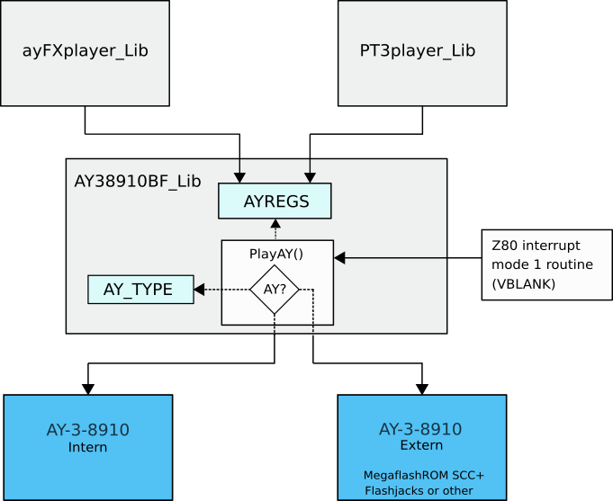

# PSG AY-3-8910 BF MSX SDCC Library (fR3eL Project)

<table>
<tr><td>Architecture</td><td>MSX</td></tr>
<tr><td>Format</td><td>C Object (SDCC .rel)</td></tr>
<tr><td>Programming language</td><td>C and Z80 assembler</td></tr>
<tr><td>Compiler</td><td>SDCC v4.4 or newer</td></tr>
</table>

---

## Description

Library of functions to be able to play sounds and/or music with the PSG AY-3-8910.

This library is designed to work with other libraries that use a buffer of AY registers (such as [PT3player](https://github.com/mvac7/SDCC_PT3player) and/or [ayFXplayer](https://github.com/mvac7/SDCC_ayFXplayer)). 
Includes a function that safely dumps buffer values ​​to an AY-3-8910 PSG.
It allows to use the internal PSG of the MSX or an external one (like the one incorporated in the MEGAFLASHROM SCC+, Flashjacks, Carnivore2 or others).

This project consists of two libraries that complement each other:
- **PSG_AY38910BF** Includes only the functions necessary to play songs or effects (requires third-party libraries).
- **PSG_AY38910BF_Xfunctions** (optional) Adds specific functions to make it easier to write AY parameters. Requires the PSG_AY38910BF library.

It does not use the BIOS so it can be used to program for ROMs, MSX BASIC or MSX-DOS environments.

It incorporates the SOUND function with the same behavior as the command included in MSX BASIC, 
as well as specific functions to modify the different sound parameters of the AY. 

Security control of the I/O port enable bits in the Mixer register.
On some MSX computers that incorporate an AY-3-8910, they may be damaged if incorrect activation values ​​are written.
This library reads the port trigger values ​​and persists them, every time the PlayAY function is executed.

You can access the documentation here with [`How to use the library`](docs/HOWTO.md).

In the source code [`examples/`](examples/), you can find applications for testing and learning purposes.

 

These libraries are part of the [MSX fR3eL Project](https://github.com/mvac7/SDCC_MSX_fR3eL).

Use them for developing MSX applications using Small Device C Compiler [`SDCC`](http://sdcc.sourceforge.net/).

This project is an Open Source. 
You can add part or all of this code in your application development or include it in other libraries/engines.

Enjoy it!

 

---

## History of versions

### PSG_AY38910BF

- v1.0  (08/02/2025) update to SDCC (4.1.12) Z80 calling conventions
- v0.9b (16/07/2021) First version (Based in AY-3-8910 RT Library)

 

### PSG_AY38910BF_Xfunctions

- v1.0  (03/03/2025) First version

 

---

## Requirements

- [Small Device C Compiler (SDCC) v4.4](http://sdcc.sourceforge.net/)
- [Hex2bin v2.5](http://hex2bin.sourceforge.net/)

 

---

## Functions

### PSG_AY38910BF

| Name | Declaration | Description |
| ---  | ---         | ---         |
| InitAY    | `InitAY()` | Initialize the library. Set default AY (internal) and clear buffer. |
| SilenceAY | `SilenceAY()` | Silences the indicated AY sound processor. |
| SilenceAYbyPort | `SilenceAYbyPort(char AY_port)` | Silences the indicated AY sound processor. |
| PlayAY    | `PlayAY()` | Copy buffer to selected AY (AY_IOport) |
| Dump2AY   | `Dump2AY(char AY_port, unsigned int bufferADDR)` | Dump a buffer to the indicated AY |
| SOUND     | `SOUND(char reg, char value)` | Writes a value to the PSG register buffer |
| GetSound  | `char GetSound(char reg)` | Read PSG register value (from buffer) |

 

### PSG_AY38910BF_Xfunctions

| Name | Declaration | Description |
| ---  | ---         | ---         |
| SetTonePeriod     | `SetTonePeriod(char channel, unsigned int period)` | Set Tone Period for any channel |
| SetNoisePeriod    | `SetNoisePeriod(char period)` | Set Noise Period |
| SetEnvelopePeriod | `SetEnvelopePeriod(unsigned int period)` | Set Envelope Period |
| SetVolume         | `SetVolume(char channel, char volume)` | Set volume channel |
| SetChannel        | `SetChannel(char channel, switcher isTone, switcher isNoise)` | Mixer. Enable/disable Tone and Noise channels |
| SetEnvelope       | `SetEnvelope(char shape)` | Set envelope shape |

