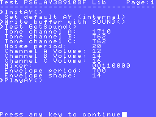
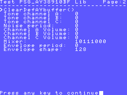
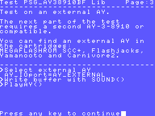
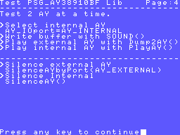
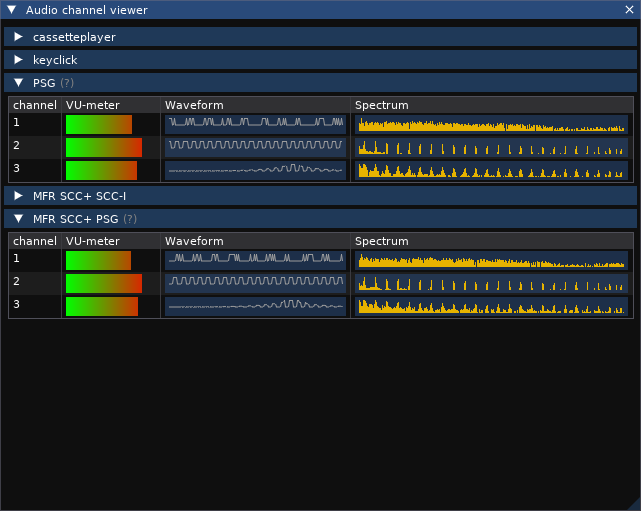
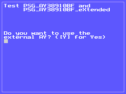
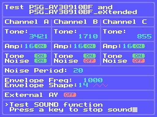

# PSG AY-3-8910 BF MSX SDCC Libraries (fR3eL Project)

<table>
<tr><td rowspan=2>Name</td><td>PSG_AY38910BF</td></tr>
<tr><td>PSG_AY38910BF_eXtended</td></tr>
<tr><td>Architecture</td><td>MSX</td></tr>
<tr><td>Environment</td><td>ROM, MSX-DOS, MSX BASIC</td></tr>
<tr><td>Programming language</td><td>C</td></tr>
<tr><td>Format</td><td>SDCC Relocatable object file (.rel)</td></tr>
<tr><td>Compiler</td><td>SDCC v4.4</td></tr>
</table>

---

## Description

C function libraries with functions to play sounds and/or music with the PSG AY-3-8910 or compatibles.

This project consists of two libraries that complement each other:
- **PSG_AY38910BF** Includes only the functions necessary to play songs or effects (requires third-party libraries).
- **PSG_AY38910BF_eXtended** (optional) Adds specific functions to make it easier to write AY parameters. Requires the PSG_AY38910BF library.

PSG_AY38910BF includes the SOUND function with the same behavior as the command included in MSX BASIC, 
while PSG_AY38910BF_eXtended contains specific functions to modify the different sound parameters of the AY.

Security control of the I/O port enable bits in the Mixer register.
On some MSX computers that incorporate an AY-3-8910, they may be damaged if incorrect activation values ​​are written.
This library reads the port trigger values ​​and persists them, every time the PlayAY function is executed.

You can access the documentation here with [`How to use the library`](docs/HOWTO.md).

These libraries are part of the [MSX fR3eL Project](https://github.com/mvac7/SDCC_MSX_fR3eL).

You can use this library to develop applications for ROM, MSXBASIC or MSX-DOS environments, 
using the Small Device C Compiler [(SDCC)](http://sdcc.sourceforge.net/) cross compiler.

This project is open source under the [MIT license](LICENSE). 
You can add part or all of this code in your application development or include it in other libraries/engines.

Enjoy it!

 

---

## History of versions

### PSG_AY38910BF Library

- v1.0  (08/02/2025) update to SDCC (4.1.12) Z80 calling conventions
- v0.9b (16/07/2021) First version (Based in AY-3-8910 RT Library)

 

### PSG_AY38910BF_eXtended Library

- v1.1 (14/08/2025) 
	- Added EnableEnvelope, EnableTone and EnableNoise functions
	- Removed SetChannel function
- v1.0 (03/03/2025) First version

 

---

## Requirements

- [Small Device C Compiler (SDCC) v4.4](http://sdcc.sourceforge.net/)
- [Hex2bin v2.5](http://hex2bin.sourceforge.net/)

 

---

## fR3eL Sound System

This library is designed to work with other libraries that use a buffer of AY registers (such as [PT3player](https://github.com/mvac7/SDCC_PT3player) and/or [ayFXplayer](https://github.com/mvac7/SDCC_ayFXplayer)). 
Includes a function that safely dumps buffer values ​​to an AY-3-8910 PSG.
It allows to use the internal PSG of the MSX or an external one (like the one incorporated in the MEGAFLASHROM SCC+, Flashjacks, Yamanooto, Carnivore2 or others).

 

 

---

## Functions

### PSG_AY38910BF Library

| Name | Declaration | Description |
| ---  | ---         | ---         |
| InitAY    | `InitAY()` | Initialize the library. Set default AY (internal) and clear buffer. |
| ClearDefAYbuffer | `ClearDefAYbuffer()` | Clear default AY buffer (AYREGS) |
| ClearAYbuffer    | `ClearAYbuffer(bufferADDR)` | Clear indicated AY buffer |
| SOUND     | `SOUND(char reg, char value)` | Writes a value to the PSG register buffer |
| GetSound  | `char GetSound(char reg)` | Read PSG register value (from buffer) |
| PlayAY    | `PlayAY()` | Copy buffer to selected AY (AY_IOport) |
| Dump2AY   | `Dump2AY(char AY_port, unsigned int bufferADDR)` | Dump a buffer to the indicated AY |
| SilenceAY | `SilenceAY()` | Silences the indicated AY sound processor. |
| SilenceAYbyPort | `SilenceAYbyPort(char AY_port)` | Silences the indicated AY sound processor. |

 

### PSG_AY38910BF_eXtended Library

| Name | Declaration | Description |
| ---  | ---         | ---         |
| SetTonePeriod     | `SetTonePeriod(channel, period)` | Set Tone Period for any channel |
| SetNoisePeriod    | `SetNoisePeriod(period)` | Set Noise Period |
| SetVolume         | `SetVolume(channel, volume)` | Set volume channel |
| EnableTone        | `EnableTone(channel, state)` | Mixer. Enables or disables Tone channel  |
| EnableTone        | `EnableTone(channel, state)` | Mixer. Enables or disables noise on a channel |
| EnableEnvelope    | `EnableEnvelope(channel, state)` | Enables or disables sound envelope on a channel |
| SetEnvelopePeriod | `SetEnvelopePeriod(period)`      | Set Envelope Period |
| SetEnvelope       | `SetEnvelope(shape)`             | Set envelope shape |

 

---

## Code Examples

The project includes several examples that I have used to test the library and that can help you learn how to use this library.

 

### TestPSGAYBFLib

Performs a test of the functions of the PSG_AY38910BF library.

MSX 8K ROM

[`Sourcecode`](PSG_AY38910BF/test)

 
  
 
 
 

 

### TestAY

Performs a test of the functions of the PSG_AY38910BF and PSG_AY38910BF_eXtended libraries.

MSX 16K ROM

[`Sourcecode`](PSG_AY38910BF_eXtended/test)

 
 
